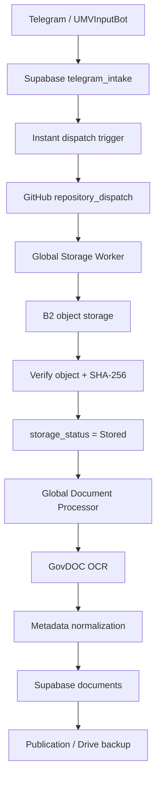

# School Document Pipeline — Production Baseline

**Baseline date:** 2026-09-12

This document is the stability baseline for the School Document Pipeline. Future improvements must be built **above this baseline** and must preserve the contracts and behavior documented here unless a deliberate versioned change is approved.

## Baseline E2E flow

## Proven baseline

- Telegram intake returns without waiting synchronously for GitHub downstream processing; the former Telegram 504 timeout path is removed.
- Supabase intake trigger dispatches to the GitHub document pipeline asynchronously.
- Current Vault GitHub dispatch token is accepted by the repository dispatch endpoint.
- `repository_dispatch` successfully starts the Document Processor workflow.
- Storage Worker stores Telegram files in Backblaze B2 and verifies the object.
- `storage_status=Stored` is the canonical handoff into document processing.
- GovDOC Vision is the authoritative OCR integration for production processing. Legacy OCR is not silently substituted when GovDOC fails.
- OCR metadata is normalized before insertion into `public.documents`.
- Metadata boundary handles unsupported category keys safely without modifying the OCR engine.
- Malformed/impossible dates are rejected/normalized before database insertion.
- The real recovery test reached `Processed/Stored`, generated a real Supabase document record, and published successfully.
- The read-only stage-aware pipeline watchdog is active and reports broken/stalled stages without creating synthetic documents.
- Legacy Drive/App-Script OCR records are kept distinct from the canonical Telegram → B2 → GovDOC path to avoid false-positive health failures.

## Stage contracts

| Stage | Success condition | Primary failure signal |
|---|---|---|
| Telegram intake | `telegram_intake` row created promptly | webhook timeout / missing row |
| Dispatch | GitHub `repository_dispatch` accepted | HTTP 4xx/5xx / no workflow run |
| Storage | B2 object exists and verifies | missing object / checksum mismatch |
| Stored handoff | `storage_status=Stored` | stalled non-Stored row |
| Processor | processing completes | failed/stalled workflow or row |
| GovDOC OCR | OCR result/provenance present | OCR exception / missing result |
| Metadata | valid FK/category/date/required fields | Supabase constraint error |
| Publication | published state and public link consistent | publication mismatch |

## Watchdog baseline

The watchdog is **read-only**. It does not create fake documents, alter OCR features, or silently clear failures. Its job is to identify the first broken stage and report the affected real record.

Baseline thresholds:

- Telegram intake → B2: 10 minutes
- B2 Stored → Processor: 20 minutes
- Processing: 30 minutes
- Published → delivery: 15 minutes

## Baseline invariants for future work

1. No fake/synthetic documents for testing production flow.
2. GovDOC remains the canonical production OCR engine.
3. OCR output is not silently relabeled as another OCR engine.
4. Existing working Telegram → Supabase → B2 → GovDOC → metadata behavior must not regress.
5. Future changes must add resilience, observability, safety, correctness, performance, or usability **above this known-good baseline**.
6. Every significant change must have a live or repository-backed verification result recorded.

## Known baseline caveat

Supabase security hardening may still be required for tables with disabled RLS. Such hardening is separate from the functional document-processing baseline and must be implemented with explicit policies rather than disabling or bypassing application behavior.

## Baseline acceptance statement

As of 2026-09-12, the canonical School Document Pipeline has demonstrated a real end-to-end successful document path through Telegram intake, Supabase, B2 storage, GitHub dispatch, GovDOC OCR, metadata persistence, and publication. Future improvements start from this state and must not regress it.
