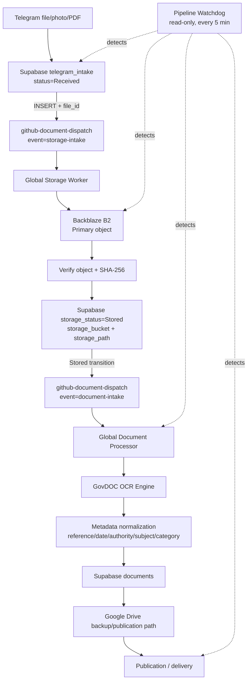

# School Document Pipeline — Production Flow & Operations

## Purpose

This is the canonical flow for documents received from Telegram. The pipeline is event-driven for normal processing; the existing 5-minute schedules remain as recovery/fallback workers.

## Production flow diagram

## Stage contract

| Stage | Success signal | Broken/stalled signal |
|---|---|---|
| Telegram → Supabase | intake row exists with `file_id`, `status=Received` | webhook errors or no row |
| Supabase → Storage Worker | `storage-intake` dispatch accepted | `Received` + file older than 10 min with no `Stored` |
| Storage Worker → B2 | `storage_status=Stored`, bucket/path present | missing object metadata or B2 verification failure |
| B2 → Processor | `document_id`/document record appears | Stored file older than 20 min with no document |
| Processor → GovDOC OCR | document completes with `extraction_method` containing `GovDOC Vision` and OCR text | Processing >30 min, `Processing Failed`, or missing GovDOC provenance |
| Publication → Telegram delivery | published record + delivery audit | Published >15 min without delivery audit |

## Broken-document detection

`global-automation/scripts/document/pipeline_health.py` is a **read-only watchdog**. It does not create documents, alter OCR, or mutate production rows.

It reports explicit connection failures such as:

- `BROKEN TELEGRAM→B2`
- `BROKEN B2 METADATA`
- `BROKEN B2→PROCESSOR`
- `PROCESSOR STALLED`
- `PROCESSOR FAILED`
- `OCR PROVENANCE BROKEN`
- `OCR RESULT MISSING`
- `PUBLICATION INCONSISTENT`
- `DELIVERY PENDING`
- `LINK DRIFT`

The watchdog exits non-zero when a hard issue is detected, making the GitHub Actions run visibly red for operator attention.

## Recovery behavior

The watchdog is detection-only. Recovery is handled by the existing storage/document recovery workflows and the 5-minute fallback schedules. A broken connection must be traceable to the affected document before any manual replay.

## Live integration verification

The event-driven GitHub dispatch path has been verified with the current Vault token: a `repository_dispatch` request returned HTTP 204 and created a real `Global Document Processor` run. The processor workflow completed successfully for the dispatched recovery test. See GitHub Actions run history for the evidence.

## Safety rules

- No fake Telegram documents are created for testing.
- No OCR engine/model/language-pack feature is changed by the watchdog.
- Secrets are never written to source.
- A detection failure never silently converts into a successful document state.
- Existing scheduled workers remain available as fallback/recovery safety nets.

## Key files

- `.github/workflows/global-storage-worker.yml`
- `.github/workflows/global-document-processor.yml`
- `.github/workflows/global-document-pipeline-health.yml`
- `global-automation/scripts/document/pipeline_health.py`
- `global-automation/scripts/document/document_processor_with_govdoc.py`
- `global-automation/govdoc-ocr/`
